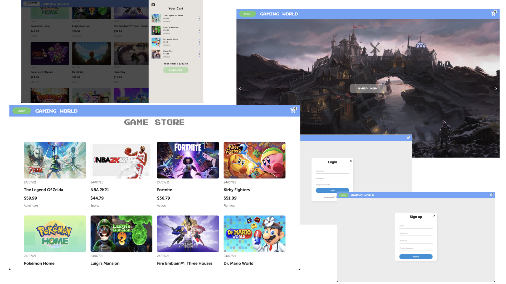
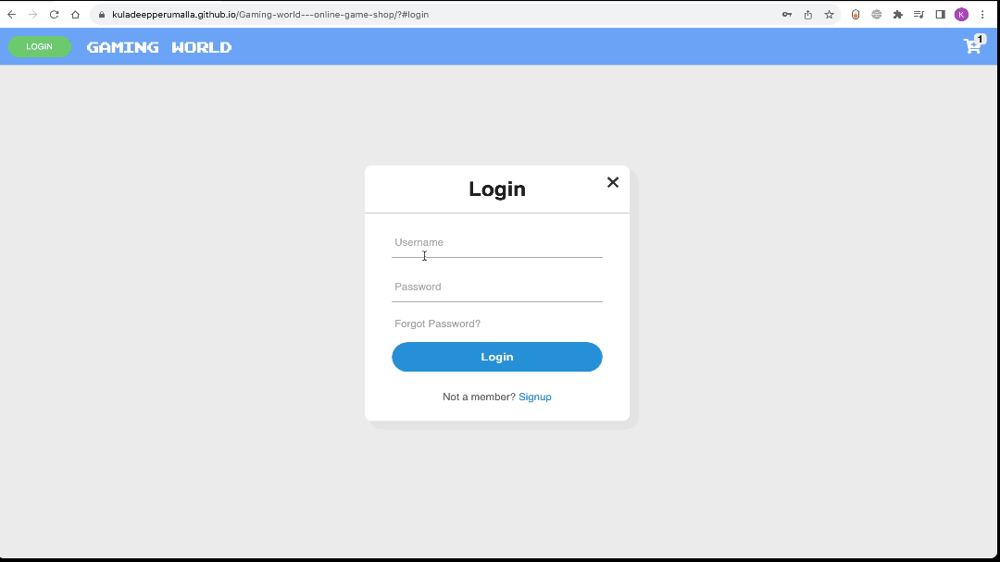
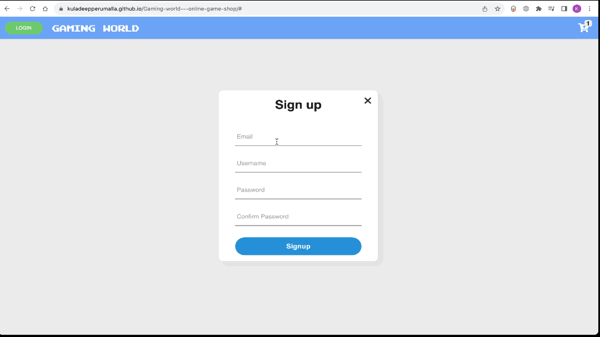

# Gaming World - Online game shop 

> eCommerce platform built with Vanilla Javascript and Sass, data stored in local storage, and data fetched from local db.json.



This project is part of my proof of concept. It is built by using JavaScript classes and local storage. See it in action at [Demo](https://kuladeepperumalla.github.io/Gaming-world---online-game-shop/)


## Table of Contents

- [Introduction](#introduction)
- [Features](#features)
- [Build Process](#build-process)
- [Developer](#Developer)


## Introduction

> Gaming World is an online game store for gaming enthusiasts.
- It has a beautiful landing page with auto slide of the latest games and a shop now button which takes to the game product cards
- All the product cards are fetched from a custom JSON file named games.json they are mapped and displayed using javascript template literals.

****

<p align="center">
  
</p>


## Features

A few of the things you can do with Gaming world:

****
> Login
<p align="center">
  
</p>

> Signup
<p align="center">
  
</p>

> Add to cart
<p align="center">
  
</p>

> Checkout
<p align="center">
  
</p>

> Responsive layout
<p align="center">
  
</p>


## Build Process


## 💻 Run Locally

Clone the project

```bash
  git clone https://github.com/kuladeepperumalla/Gaming-world---online-game-shop.git
```

Go to the project directory

```bash
  cd Gaming-world---online-game-shop
```

Install dependencies

```bash
  npm install
```

Start the server

```bash
  npm run start
```


---


## Developer

This project is brought to you by  [Kuladeep Perumalla](https://github.com/kuladeepperumalla)).

